Financial IT Risk Control Automation Workflow (Databricks)
Overview

Simple financial risk analysis workflow using Databricks and PySpark.

Combines:

system logs
transactions data
holdings data

Goal: detect IT risk, banking risk, financial risk using login behavior + transaction activity

Step 1: Import libraries and load system log data

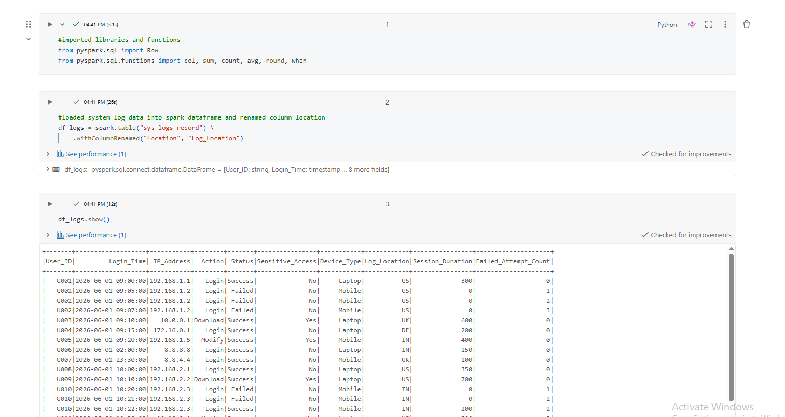

Step 2: Load transactions and holdings data

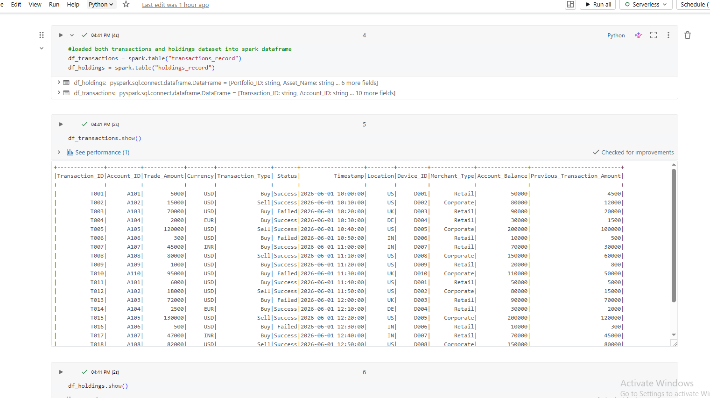

Step 3: Analyze login activity and failures

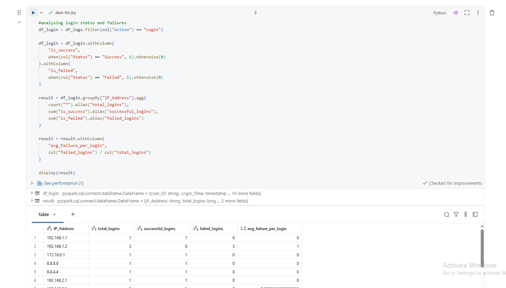

Step 4: Create mapping table

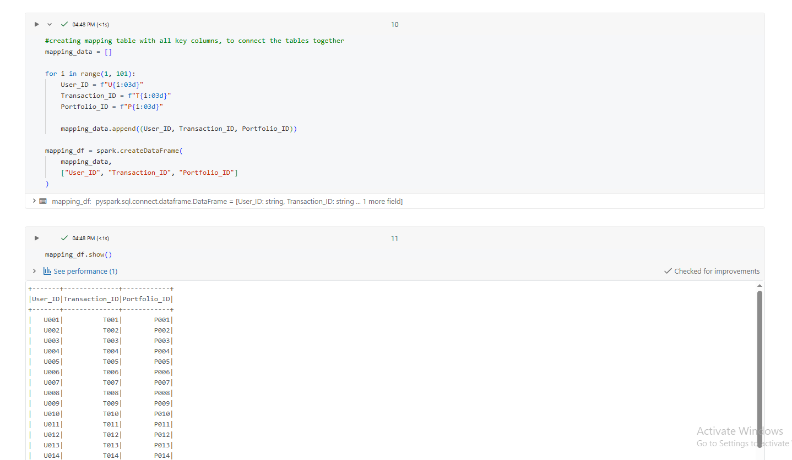

Step 5: Join all datasets

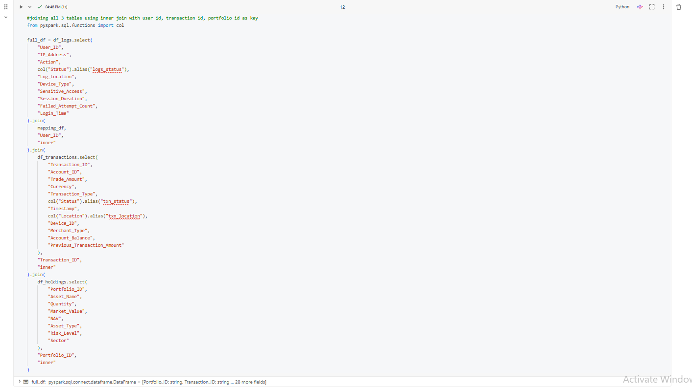

Step 6: Risk logic

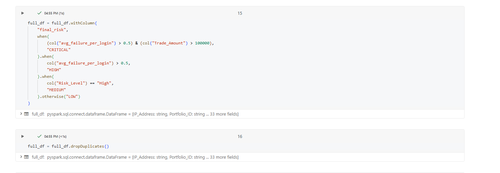

Step 7: Final output table creation

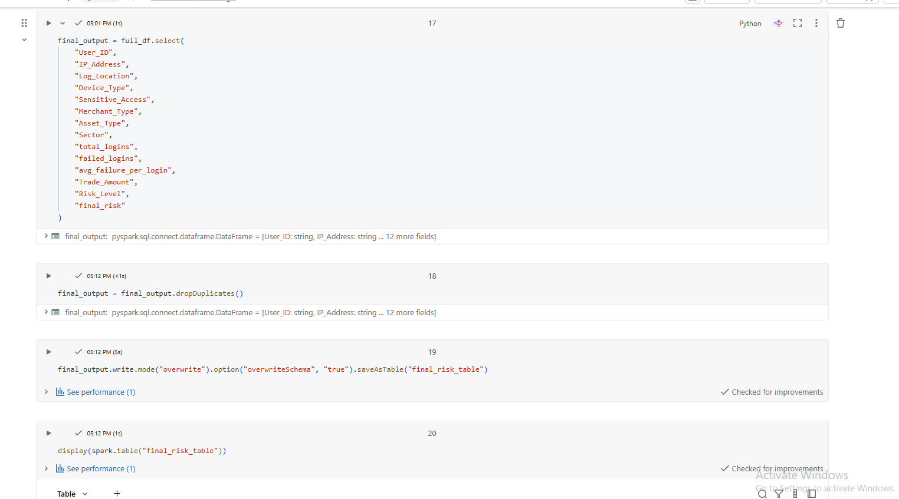

Step 8: Visualizations

Risk volume

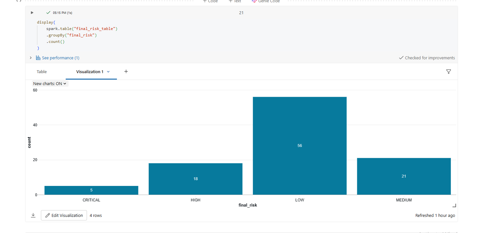

By location

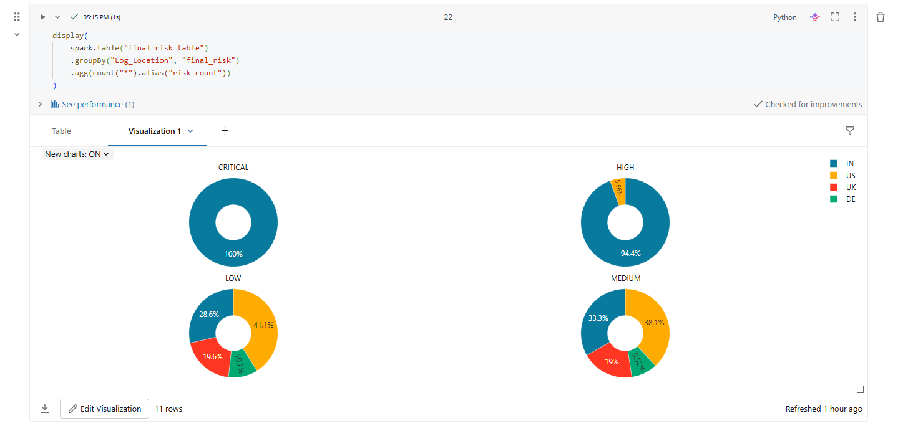

By device type

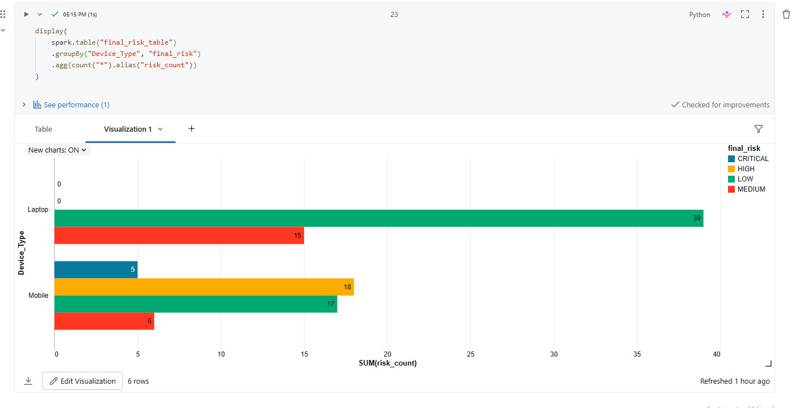

By merchant type

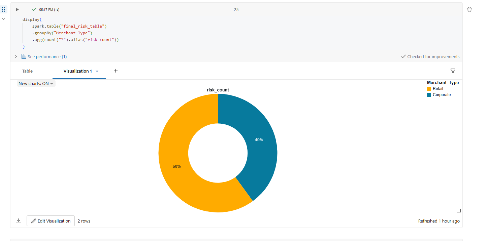

By asset type

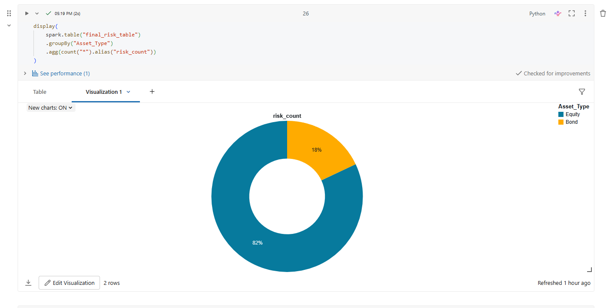

By sector

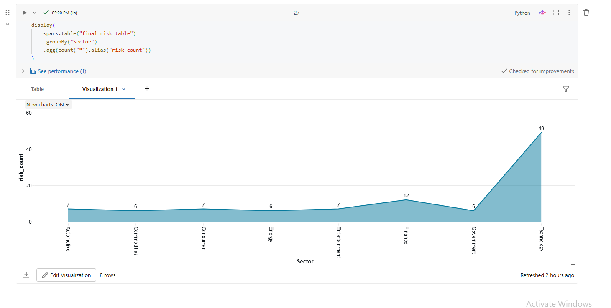

By user

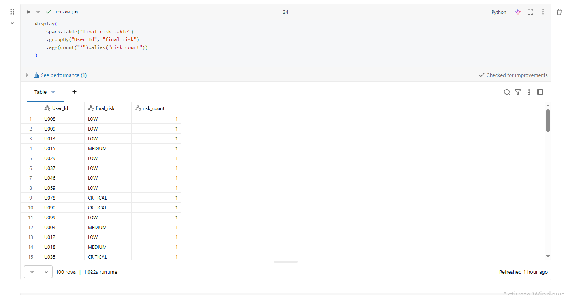

Final Output

Table: final_risk_table

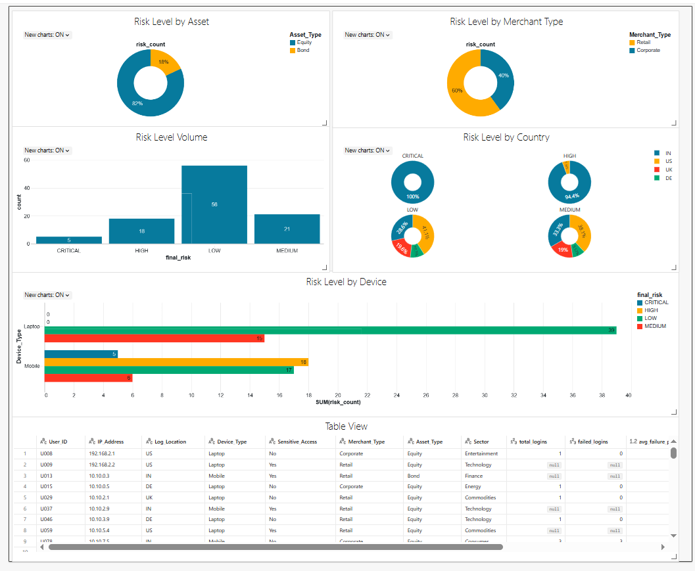

Finally, automated the workflow using Databricks Jobs section to refresh data daily at 9 AM IST.

Contains:

user activity
transaction data
holdings data
calculated risk level
Summary
automated workflow
joins 3 datasets
detects IT + financial risk
rule-based risk scoring
ready for dashboard use
